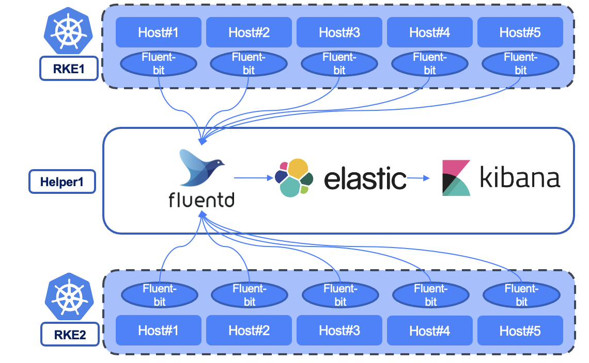
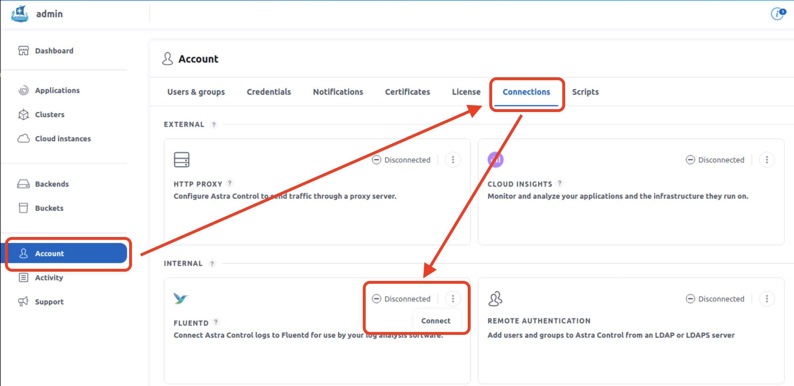
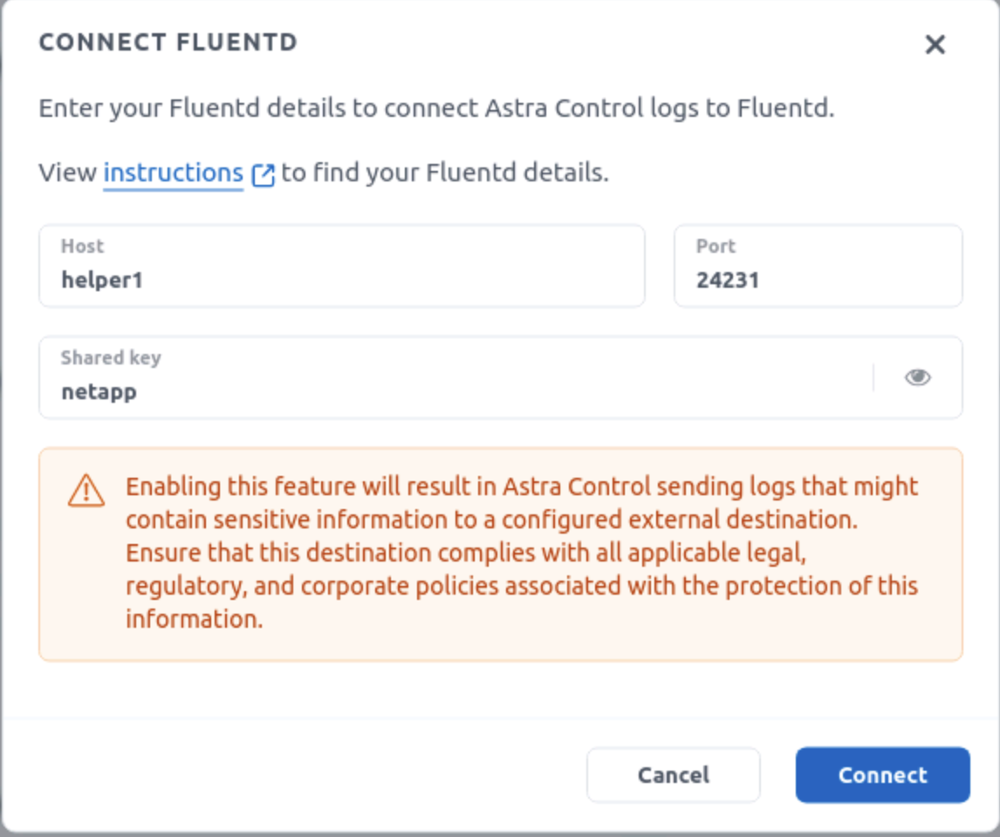
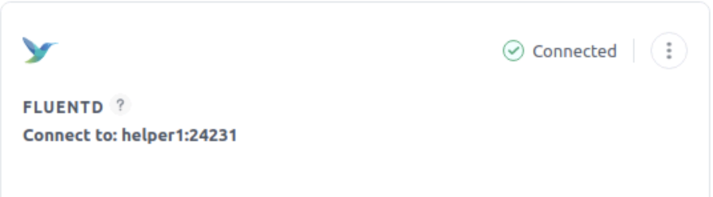
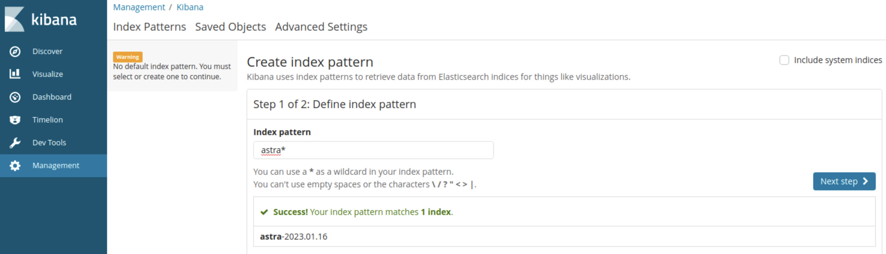
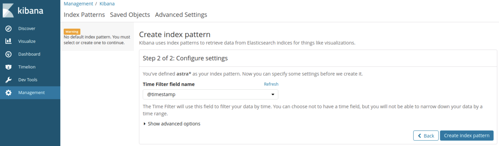
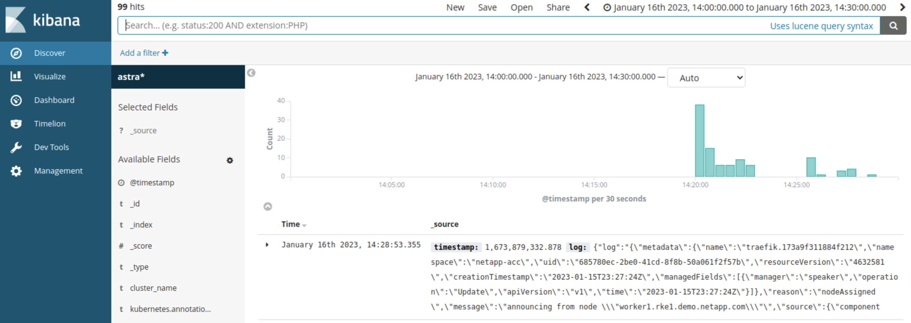

#########################################################################################
# SCENARIO 2: Install & configure a logging stack (EFK) 
#########################################################################################

Astra Control gives you the possibility to create a connection with a log analysis software.  
A popular logging stack is based on Elasticsearch, Fluentd and Kibana (EFK)

This scenario will guide you through the following :
- Install & configure Elasticsearch 6.1.0, a distributed and scalable search engine
- Install & configure Kibana 6.1.0, a data visualization frontend for Elasticsearch
- Install & configure Fluentd (td-agent v3), which will collect all the logs and ship them to Elasticsearch
- Connect Astra Control with Fluentd

Both Elasticsearch & Kibana have much more recent versions available. However, for the time being I will guide you with the v6.1.0.  

This folder contains a *all_in_one.sh* file that will deploy & configure everything for you. It must be launched on the Helper1 host.  
Also, please refer to the [Addenda01](../../Addendum/Addenda01/) to learn how to retrieve both _AccountID_ & _API Token_ which are required with the Astra Control's API calls.  

Each Kubernetes node already comes with _Fluentbit_ pods which will be configured to forward logs to Fluentd:  

<p align="center"></p>

## A. Prerequirements

Installing EFK requires a few steps beforehand:
- Install Java
- Install a NTP Server (_chronyd_ for instance)
- Disable the firewall (for this lab)

```bash
dnf install -y java-1.8.0-openjdk
java -version

systemctl start chronyd
systemctl stop firewalld
```

## B. Install Elasticsearch

We will download & install the Elasticsearch package, as well as create a specific user/group in which it will run.  
By default, Elasticsearch will be available on the port 9200.  

```bash
cd && mkdir elasticsearch && cd elasticsearch
curl -O https://artifacts.elastic.co/downloads/elasticsearch/elasticsearch-6.1.0.tar.gz
tar -xf elasticsearch-6.1.0.tar.gz
cd elasticsearch-6.1.0

groupadd elasticsearch
useradd elasticsearch -g elasticsearch -p elasticsearch
chown -R elasticsearch:elasticsearch /root/elasticsearch
chmod o+x /root/ /root/elasticsearch/
chgrp elasticsearch /root/elasticsearch/
su -m elasticsearch -c "cd /root/elasticsearch/elasticsearch-6.1.0 && ./bin/elasticsearch -d -p pid"
sleep 5
```

Time to check if the installation was correctly done:  
```bash
$ curl localhost:9200
{
  "name" : "zy1axzE",
  "cluster_name" : "elasticsearch",
  "cluster_uuid" : "kBsC6XdHSj6yMMv_5PQUiQ",
  "version" : {
    "number" : "6.1.0",
    "build_hash" : "c0c1ba0",
    "build_date" : "2017-12-12T12:32:54.550Z",
    "build_snapshot" : false,
    "lucene_version" : "7.1.0",
    "minimum_wire_compatibility_version" : "5.6.0",
    "minimum_index_compatibility_version" : "5.0.0"
  },
  "tagline" : "You Know, for Search"
}
```

## C. Install Kibana

Similar as in the previous paragraph, we are going to download & configure Kibana.  
In order to allow connections for remote users (the lab jumphost for instance), Kibana's configuration file will be edited to modify the _server.host_ parameter. By default, Kibana will be available on the port 5601.  

```bash
cd && mkdir kibana && cd kibana
curl -O https://artifacts.elastic.co/downloads/kibana/kibana-6.1.0-linux-x86_64.tar.gz
tar -xf kibana-6.1.0-linux-x86_64.tar.gz
mv kibana-6.1.0-linux-x86_64 kibana

cd kibana
cp config/kibana.yml config/kibana.yml.bak
sed -i '/server\.host\:/s/^#//' config/kibana.yml
sed -i '/server\.host\:/s/localhost/helper1/' config/kibana.yml
./bin/kibana &
sleep 5
```

Time to check if the installation was correctly done:  
```bash
$ curl helper1:5601/status -I
HTTP/1.1 200 OK
kbn-name: kibana
kbn-version: 6.1.0
cache-control: no-cache
Date: Mon, 16 Jan 2023 13:41:28 GMT
Connection: keep-alive
```

You can also open a browser and go to http://helper1:5601 which will open the Kibana GUI.  

## D. Install Fluentd (td-agent)

Let's install td-agent from Treasure Data, which is a stable & supported version of Fluentd which can also be installed via RPM Packages.  
For a complete list of differences between Fluentd & td-agent, you can refer to https://www.fluentd.org/faqs.  

The first part essentially consists in installing the td-agent as well as dealing with certificates.  
```bash
curl -L https://toolbelt.treasuredata.com/sh/install-redhat-td-agent3.sh | sh
cd /etc/td-agent
openssl req -new -passout pass:"netapp1" -x509 -sha256 -days 1095 -newkey rsa:2048 -keyout fluentd.key -out fluentd.crt -subj "/C=FR/ST=IdF/L=Paris/O=YvosCorp/OU=IT/CN=demo.netapp.com/emailAddress=admin@demo.netapp.com"
mkdir -p /etc/td-agent/certs
mv fluentd.* /etc/td-agent/certs
chown td-agent:td-agent -R /etc/td-agent/certs
chmod 700 /etc/td-agent/certs/
chmod 400 /etc/td-agent/certs/fluentd.key
mv td-agent.conf td-agent.conf.bak
```

We can now create the td-agent configuration file, which defines:
- What port listens to incoming data (where Astra Control is going to send its logs)
- What format this data has & if a transformation needs to be applied
- Where & how to send the data

```bash
cat <<EOT >> /etc/td-agent/td-agent.conf
<source>
  @type forward
  port    24231
  bind 0.0.0.0
  @log_level error
  <security>
    self_hostname astra
    shared_key netapp
  </security>
  <transport tls>
    cert_path /etc/td-agent/certs/fluentd.crt
    private_key_path /etc/td-agent/certs/fluentd.key
    private_key_passphrase netapp1
  </transport>
  @id input_forward
</source>

<match managed-cluster.events>
  @type elasticsearch
  logstash_format true
  logstash_prefix astra
</match>
EOT

sudo systemctl start td-agent.service
```

## E. Configure Astra Control to send its logs to td-agent.

This can be done in the GUI or REST API.  
The latter is the method chosen in the *all_in_one.sh* script. Here, we will choose the GUI to show you a different way.  

<p align="center"></p>

<p align="center"></p>

<p align="center"></p>

To check that the configuration has well been taken into account, you can look at the fluent-bit configuration provided by ACC:
```bash
$ rke1
$ kubectl describe -n netapp-acc configmap/fluent-bit-config | grep forward -A 7 -B 1
[OUTPUT]
    Name          forward
    Match         managed-cluster.events
    Host          helper1
    Port          24231
    Shared_Key    netapp
    Self_Hostname $HOSTNAME
    tls           on
    tls.verify    off
```

There you go. You have succesfully setup your logging environment !  

If you want to force Astra Control to send some data, you can run the following, which will fail, hence generate some logs...  
```bash
kubectl run nginx --image=nginx101
```

## F. Browse through Kibana

Once connected to Kibana, the first steps consists in creating an Index pattern (in the _Management_ page).  
We configured in td-agent logs to be transfered with a timestamp, and prefixed with _astra_.  
You can then configure your index accordingly.  

<p align="center"></p>

<p align="center"></p>

From there, by clicking on the _Discover_ page, you will be able to see and browser through all the logs forwarded by Astra Control.  

<p align="center"></p>

Tadaaaaa !