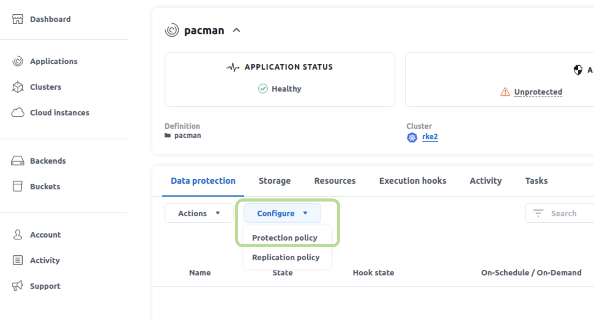

#########################################################################################
# SCENARIO 3.2: Let's enable Pacman's protection 
#########################################################################################

We will use Astra Control Center to create :
- a manual snapshot (ie on-demand)
- a manual backup (ie on-demand)
- a protection policy to automatically take consistent snapshots & backups
- a replication policy between the 2 RKE clusters

If you like working with APIs, the *all_in_one.sh* script will go through all those tasks for you.  
However, in this page, I will guide you through the ACC GUI.  

Pacman runs on RKE2, so let's discover it in the ACC GUI.  
You can either browse through the numerous namespaces already present on RKE2 (_not that many_ ...), or filter directly with the namespace name:  

Once you define this namespace as an ACC application, the first task run by ACC will be create a list of all resources that compose Pacman.  
Back to the applications screen of ACC, you will see a _healthy_ Pacman, which is however _not protected_ (just yet).

One of the many strengths of Astra Control is to integrate with the applications to protect, through hooks, in order to create consistent snapshots & backups. Some hooks are already available on this [link](https://github.com/NetApp/Verda). Let's create a _pre-snapshot_ & a _post-snapshot_ hooks for MongoDB, the underlying database used to store the scores of this game. You could decide to apply hooks to all containers of an application, or just specific containers with a filterring option. We will choose the latter & filter on _mongo_ in order to manage the database.  

Once done, you can see that the hooks have been applied on the right container, with the _mongo:3.2_ image.

Let's click on the _Data Protection_ tab to create a _Protection Policy_.

These policies will define when you take a _snapshot_, how many you want to keep at one point in time, & how many are to the _backup_ platform.

We can also manually create snapshots if you dont/cant wait for the first automated snapshot to be taken.  
It is as easy as just chosing a name for this snapshot:

It just takes a few seconds to complete. You end up with a healthy brand new snapshot.  

The same applies to _backups_. Let's manually create one, based on the snapshot we just added.

It takes a little bit more time (couple of minutes) to complete, as there is data movement involved this time.  
Nonetheless, we end up with a healthy backup.

Last, as we have 2 separate Rancher clusters, as well as 2 separate ONTAP clusters, let's put in place a DRP (ie _Disaster Recovery Protocol_) for our favorite application. We are never too safe, and a whole datacenter or zone could fail ! Imagine, no more pacman !! Astra Control gives you the possibility to restart a whole app in such event in a different cluster.  
Configuring this DRP is done with several parameters:
- what secondary cluster will host the mirror
- what storage class will be used to provision persistent volumes
- what schedule is used to mirror data (using NetApp _SnapMirror_ feature)

It also take a few minutes to complete, as the initialization of the mirror involved copying all the data to the secondary system. All subsequent updates will only transfer the newly written blocks.  
Once done, you will get a healthy DRP environment for pacman !

With _snapshots_, _backups_ and _DRP_ configured, now Pacman is protected from all evil !

Let's break stuff in the next chapter !
