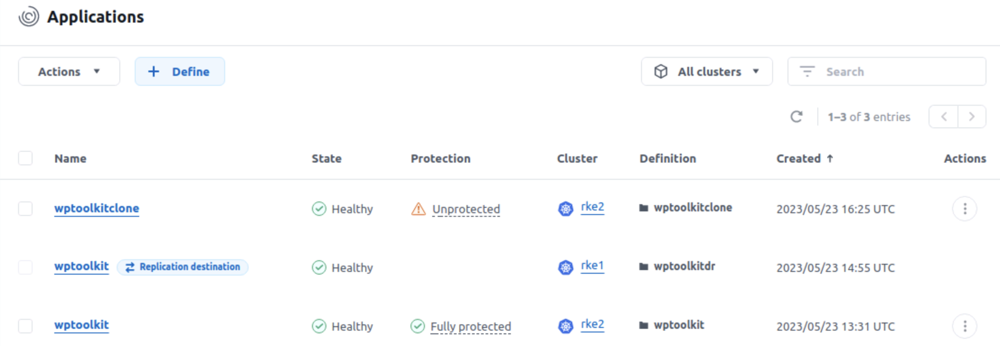

#########################################################################################
# SCENARIO 4: Protect you app with the Astra toolkit
#########################################################################################

In this chapter, we will see how to manage and protect an application (wordpress) with the Astra toolkit.  
This toolkit is super useful and can help you integrate ACC into CD tools, such as ArgoCD.  
Before going any further, make sure you have gone through the [Addenda03](../../Addendum/Addenda03/) chapter, which will guide you in the configuration of this toolkit.  

Let's start by installing Wordpress on the cluster RKE2, the following commands running on the host _helper1_:
```bash
$ rke2
$ helm install wptoolkit bitnami/wordpress --namespace wptoolkit --set wordpressUsername=astra,wordpressPassword=Netapp1! --create-namespace
NAME: wptoolkit
LAST DEPLOYED: Fri May  5 15:11:59 2023
NAMESPACE: wptoolkit
STATUS: deployed
REVISION: 1
TEST SUITE: None
NOTES:
CHART NAME: wordpress
CHART VERSION: 15.2.5
APP VERSION: 6.0.2
...
```

After a minute or so, the application shoudl be up&running:
```bash
$ kubectl get -n wptoolkit svc,pod,pvc
NAME                          TYPE           CLUSTER-IP       EXTERNAL-IP     PORT(S)                      AGE
service/wptoolkit-mariadb     ClusterIP      172.28.62.201    <none>          3306/TCP                     2m2s
service/wptoolkit-wordpress   LoadBalancer   172.28.99.215    192.168.0.231   80:30394/TCP,443:30681/TCP   2m2s

NAME                                       READY   STATUS    RESTARTS   AGE
pod/wptoolkit-mariadb-0                    1/1     Running   0          2m2s
pod/wptoolkit-wordpress-587bd88c87-b64nk   1/1     Running   0          2m1s

NAME                                             STATUS   VOLUME                                     CAPACITY   ACCESS MODES   STORAGECLASS   AGE
persistentvolumeclaim/data-wptoolkit-mariadb-0   Bound    pvc-2312becd-64f1-4cb8-8768-78efdbf417b5   8Gi        RWO            sc-nas-svm2    2m2s
persistentvolumeclaim/wptoolkit-wordpress        Bound    pvc-affb8f16-23d9-4971-914b-bd0f8e44d63c   10Gi       RWO            sc-nas-svm2    2m2s
```
Wordpress can be accessed with the address 192.168.0.231, IP retrieved from the local load balancer.  
Note that you can also deploy a helm chart with the toolkit, granted you will need to configure the kubconfig to do so.  

Let's retrieve the RKE ID that are necessary for the next steps:
```bash
$ actoolkit list clusters
+---------------+--------------------------------------+---------------+------------+----------------+----------------+------------------+
| clusterName   | clusterID                            | clusterType   | location   | managedState   | tridentState   | tridentVersion   |
+===============+======================================+===============+============+================+================+==================+
| rke1          | 1ceedd15-f771-4f13-84ac-bf181148b202 | kubernetes    |            | managed        |                | 22.10.0          |
+---------------+--------------------------------------+---------------+------------+----------------+----------------+------------------+
| rke2          | 1a18ac44-0057-47e3-a2ee-09f3cd61ab05 | kubernetes    |            | managed        |                | 22.10.0          |
+---------------+--------------------------------------+---------------+------------+----------------+----------------+------------------+
```
We can now _manage_ Wordpress with the toolkit:
```bash
$ actoolkit manage app wptoolkit wptoolkit 1a18ac44-0057-47e3-a2ee-09f3cd61ab05
{"type": "application/astra-app", "version": "2.1", "id": "233cf400-9c37-4ea0-869c-b0efb51c4c99", "name": "wptoolkit", "namespaceScopedResources": [{"namespace": "wptoolkit"}], "clusterScopedResources": [], "state": "discovering", "lastResourceCollectionTimestamp": "2023-05-23T13:31:35Z", "stateTransitions": [{"to": ["pending"]}, {"to": ["provisioning"]}, {"from": "pending", "to": ["discovering", "failed"]}, {"from": "discovering", "to": ["ready", "failed"]}, {"from": "ready", "to": ["discovering", "restoring", "unavailable", "failed"]}, {"from": "unavailable", "to": ["ready", "restoring"]}, {"from": "provisioning", "to": ["discovering", "failed"]}, {"from": "restoring", "to": ["discovering", "failed"]}], "stateDetails": [], "protectionState": "none", "protectionStateDetails": [], "namespaces": [], "namespaceMapping": [], "clusterName": "rke2", "clusterID": "1a18ac44-0057-47e3-a2ee-09f3cd61ab05", "clusterType": "kubernetes", "metadata": {"labels": [], "creationTimestamp": "2023-05-23T13:31:35Z", "modificationTimestamp": "2023-05-23T13:31:35Z", "createdBy": "15c83a9d-f109-4ab1-b831-5f0446235de9"}}

$ actoolkit get apps -c rke2
+-----------+--------------------------------------+---------------+-------------+---------+
| appName   | appID                                | clusterName   | namespace   | state   |
+===========+======================================+===============+=============+=========+
| wptoolkit | 233cf400-9c37-4ea0-869c-b0efb51c4c99 | rke2          | wptoolkit   | ready   |
+-----------+--------------------------------------+---------------+-------------+---------+
```
If you connect to the ACC GUI, you can verify that this wordpress instance is now managed by ACC.  
Note also the _id_ of this app returned by the toolkit, you will need it in the following steps.  

Before defining a protection policy, we first need to configure the Pre- and Post-snapshot hooks in order to get application consistant snapshots. The very first step will be to locally clone the existing hooks available on NetApp's GitHub (repo: _Verda_), followed by the upload of the MariaDB scripts in Astra Control and finally the hooks configuration for Wordpress:
```bash
$ git clone https://github.com/NetApp/Verda

$ actoolkit create script mariadb /apps/Verda/Mariadb-MySQL/mariadb_mysql.sh

$ actoolkit list scripts
+--------------+--------------------------------------+---------------+
| scriptName   | scriptID                             | description   |
+==============+======================================+===============+
| mariadb      | 404959ef-643f-4833-8028-ce2f82f84294 |               |
+--------------+--------------------------------------+---------------+

$ actoolkit create hook 233cf400-9c37-4ea0-869c-b0efb51c4c99 mariapre 404959ef-643f-4833-8028-ce2f82f84294 -o pre-snapshot -a pre -r "\bmariadb\b"

$ actoolkit create hook 233cf400-9c37-4ea0-869c-b0efb51c4c99 mariapost 404959ef-643f-4833-8028-ce2f82f84294 -o post-snapshot -a post -r "\bmariadb\b"

$ actoolkit list hooks -a wptoolkit
+--------------------------------------+------------+--------------------------------------+------------------------------------------------+
| appID                                | hookName   | hookID                               | matchingImages                                 |
+======================================+============+======================================+================================================+
| 233cf400-9c37-4ea0-869c-b0efb51c4c99 | mariapre   | fe49850a-304f-4c85-9a08-1b3cc5937816 | docker.io/bitnami/mariadb:10.6.10-debian-11-r0 |
+--------------------------------------+------------+--------------------------------------+------------------------------------------------+
| 233cf400-9c37-4ea0-869c-b0efb51c4c99 | mariapost  | a62517ec-7e26-4214-8460-ff86dc55369f | docker.io/bitnami/mariadb:10.6.10-debian-11-r0 |
+--------------------------------------+------------+--------------------------------------+------------------------------------------------+
```

Let's define the following _Protection Policy_:  
- Hourly: at the end of the first quarter of the hour, with 4 snapshots to store as well as 2 backups
- Daily: at midnight, with 2 snapshots & 2 backups to store

```bash
$ actoolkit create protection 233cf400-9c37-4ea0-869c-b0efb51c4c99 -g hourly -m 15 -b 2 -s 4
{"type": "application/astra-schedule", "version": "1.3", "id": "131be7cd-769f-4263-badc-76827f8558c9", "name": "hourly-8d9rr", "enabled": "true", "granularity": "hourly", "minute": "15", "snapshotRetention": "4", "backupRetention": "2", "metadata": {"labels": [], "creationTimestamp": "2023-05-23T13:44:25Z", "modificationTimestamp": "2023-05-23T13:44:25Z", "createdBy": "15c83a9d-f109-4ab1-b831-5f0446235de9"}}

$ actoolkit create protection 233cf400-9c37-4ea0-869c-b0efb51c4c99 -g daily -H 0 -b 2 -s 2
{"type": "application/astra-schedule", "version": "1.3", "id": "b1a77a5d-a384-4b6a-b00b-bd408fc8f5a8", "name": "daily-fnogu", "enabled": "true", "granularity": "daily", "minute": "0", "hour": "0", "snapshotRetention": "2", "backupRetention": "2", "metadata": {"labels": [], "creationTimestamp": "2023-05-23T13:45:22Z", "modificationTimestamp": "2023-05-23T13:45:22Z", "createdBy": "15c83a9d-f109-4ab1-b831-5f0446235de9"}}

$ actoolkit get protections -a 233cf400-9c37-4ea0-869c-b0efb51c4c99
+--------------------------------------+--------------------------------------+---------------+----------+--------+-------------+--------------+-----------------+-------------------+
| appID                                | protectionID                         | granularity   |   minute |   hour | dayOfWeek   | dayOfMonth   |   snapRetention |   backupRetention |
+======================================+======================================+===============+==========+========+=============+==============+=================+===================+
| 233cf400-9c37-4ea0-869c-b0efb51c4c99 | 131be7cd-769f-4263-badc-76827f8558c9 | hourly        |       15 |        |             |              |               4 |                 2 |
+--------------------------------------+--------------------------------------+---------------+----------+--------+-------------+--------------+-----------------+-------------------+
| 233cf400-9c37-4ea0-869c-b0efb51c4c99 | b1a77a5d-a384-4b6a-b00b-bd408fc8f5a8 | daily         |        0 |      0 |             |              |               2 |                 2 |
+--------------------------------------+--------------------------------------+---------------+----------+--------+-------------+--------------+-----------------+-------------------+
```

Again, if you log in the GUI, you can see these changes.  

Creating a Replication policy is a piece of cake.  
```bash
$ actoolkit create replication 233cf400-9c37-4ea0-869c-b0efb51c4c99 -c 1ceedd15-f771-4f13-84ac-bf181148b202 -n wptoolkitdr -s sc-nas-svm1 -f 5m -o 02

$ actoolkit list replications -a wptoolkit
+--------------------------------------+--------------------------------------+--------------+-------------------+-----------------+
| replicationID                        | sourceAppID                          | state        | sourceNamespace   | destNamespace   |
+======================================+======================================+==============+===================+=================+
| b73a54c9-f88d-4042-8b2d-caea21f880bf | 233cf400-9c37-4ea0-869c-b0efb51c4c99 | establishing | wptoolkit         | wptoolkitdr     |
+--------------------------------------+--------------------------------------+--------------+-------------------+-----------------+
```

Last, let's create a clone of our application based on an existing snapshot:  
```bash
$ actoolkit list snapshots -a wptoolkit
+--------------------------------------+-----------------------------------+--------------------------------------+-----------------+----------------------+
| appID                                | snapshotName                      | snapshotID                           | snapshotState   | creationTimestamp    |
+======================================+===================================+======================================+=================+======================+
| 233cf400-9c37-4ea0-869c-b0efb51c4c99 | wptoolkit-snapshot-20230523141514 | 445b7d13-e4f2-488d-a9e3-6709f2489f50 | completed       | 2023-05-23T14:15:14Z |
+--------------------------------------+-----------------------------------+--------------------------------------+-----------------+----------------------+
| 233cf400-9c37-4ea0-869c-b0efb51c4c99 | wptoolkit-snapshot-20230523151520 | a1dc8276-521b-47c5-89b9-f1eb930a4bb4 | completed       | 2023-05-23T15:15:20Z |
+--------------------------------------+-----------------------------------+--------------------------------------+-----------------+----------------------+
| 233cf400-9c37-4ea0-869c-b0efb51c4c99 | wptoolkit-snapshot-20230523161522 | 077de88b-040d-4041-a002-1857189497a7 | completed       | 2023-05-23T16:15:22Z |
+--------------------------------------+-----------------------------------+--------------------------------------+-----------------+----------------------+
| 233cf400-9c37-4ea0-869c-b0efb51c4c99 | replication-schedule-odwlv-whgvy  | 94b721f9-1dde-417d-9ac2-8447b475877f | completed       | 2023-05-23T16:17:01Z |
+--------------------------------------+-----------------------------------+--------------------------------------+-----------------+----------------------+

$ actoolkit clone -b --cloneAppName wptoolkitclone --clusterID 1a18ac44-0057-47e3-a2ee-09f3cd61ab05 --snapshotID 077de88b-040d-4041-a002-1857189497a7 
Submitting clone succeeded.
Background clone flag selected, run 'list apps' to get status.

$ actoolkit list apps
+-------------------------------------+--------------------------------------+---------------+----------------+---------+
| appName                             | appID                                | clusterName   | namespace      | state   |
+=====================================+======================================+===============+================+=========+
| wptoolkit                           | 233cf400-9c37-4ea0-869c-b0efb51c4c99 | rke2          | wptoolkit      | ready   |
+-------------------------------------+--------------------------------------+---------------+----------------+---------+
| wptoolkit (replication destination) | 93200f1d-ba74-430f-b199-cca5ebf3bc6f | rke1          | wptoolkitdr    | ready   |
+-------------------------------------+--------------------------------------+---------------+----------------+---------+
| wptoolkitclone                      | 45f15860-8f2e-42c5-a4af-7ec145f2ad64 | rke2          | wptoolkitclone | ready   |
+-------------------------------------+--------------------------------------+---------------+----------------+---------+
```

Tadaa!  
In the GUI, you can now see the following in order to prove that all went well:  
<p align="center"></p>