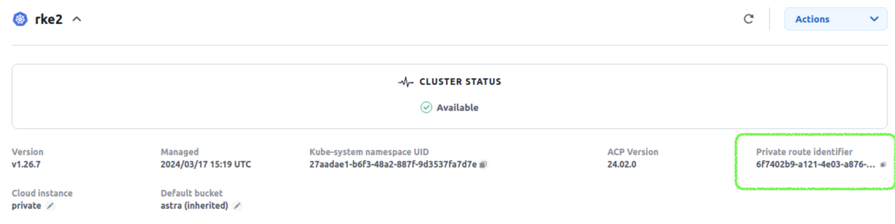

#########################################################################################
# Addenda 2: Astra Connector installation
#########################################################################################

Astra 24.02 introduced the Astra Connector to enable communication between a Kubernetes cluster & Astra Control.  
It also enables declarative management of Astra Control resources & workflows.  

This connector could be installed with or without a local private registry.  
As ACC 24.02 was installed using the lab private repository, we will use the same method to install the connector on RKE2.  

Before anything, we need to unmanage RKE2 in the current ACC Configuration.  
You can perform this task by connecting to the GUI and browser to the "clusters" page.  
Select _RKE2_ & _unmanage_ in the options of the cluster.

In order to install the connector, you also need to retrieve both _ACCOUNT ID_ & _API TOKEN_.  
To get both variables, check on the [Addenda01](../../Addenda01/).

The first step in the configuration of the connector is the installation of its operator:
```bash
kubectl apply -f https://github.com/NetApp/astra-connector-operator/releases/download/24.02.0-202403151353/astraconnector_operator.yaml
```
The connector requires two secrets:
- one than contains the ACC API Token for Astra Control  
- one for the login & password of the registry containing the container images  

```bash
kubectl create secret generic astra-token --from-literal=apiToken=<API TOKEN> -n astra-connector
kubectl create secret docker-registry regcred --docker-username=registryuser --docker-password=Netapp1! -n astra-connector --docker-server=registry.demo.netapp.com
```

We are now ready to deploy the connector:
```bash
$ cat << EOF > rke2_ac.yaml
apiVersion: astra.netapp.io/v1
kind: AstraConnector
metadata:
  name: astra-connector
  namespace: astra-connector
spec:
  astra:
    accountId: <ACCOUNT ID>
    clusterName: rke2
    skipTLSValidation: true
    tokenRef: astra-token
  natsSyncClient:
    cloudBridgeURL: https://astra.demo.netapp.com
  imageRegistry:
    name: registry.demo.netapp.com/netapp/astra/acc/24.02.0-69
    secret: regcred
EOF

$ kubectl create -f rke2_ac.yaml
```

After a few minutes, you should see the following showing that everything went fine:
```bash
$ kubectl get -n astra-connector astraconnector
NAME              REGISTERED   ASTRACLUSTERID                         ASTRACONNECTORID                       STATUS
astra-connector   true         0f807360-6d20-479c-b66c-d5750229636e   6f7402b9-a121-4e03-a876-2bc3a2347853   Registered with Astra
```

You will see that the cluster status in the ACC GUI is slightly different.  
There is a new parameter called _Private Route Identifier_ which corresponds to the connectors.
<p align="center"></p>

tadaaa!
You can now try the new declarative management of resources!