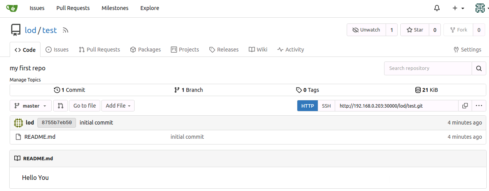
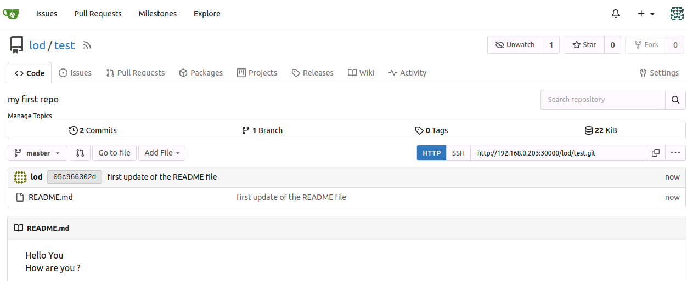

#########################################################################################
# Addenda 7: Install Gitea
#########################################################################################  

I was looking for a lightweigth git environment, which I found with Gitea.  

According to its documentation (https://about.gitea.com/):  
_Gitea is a painless self-hosted all-in-one software development service, it includes Git hosting, code review, team collaboration, package registry and CI/CD. It is similar to GitHub, Bitbucket and GitLab. Gitea was forked from Gogs originally and almost all the code has been changed. See the Gitea Announcement blog post to read about the justification for a fork._

Gitea can easily be easily installed with Helm. For this lab, we will deploy a minimal configuration:  
```bash
rke1
helm repo add gitea-charts https://dl.gitea.com/charts/
helm install gitea gitea-charts/gitea --version 10.1.3 -n gitea --create-namespace -f gitea_values.yaml
```
After a couple of minutes, you will see the following:  
```bash
kubectl get -n gitea pod,svc
NAME                        READY   STATUS    RESTARTS   AGE
pod/gitea-86bc69987-bbfzr   1/1     Running   0          35m
pod/gitea-postgresql-0      1/1     Running   0          35m

NAME                          TYPE        CLUSTER-IP      EXTERNAL-IP   PORT(S)          AGE
service/gitea-http            NodePort    172.26.82.6     <none>        3000:30000/TCP   35m
service/gitea-postgresql      ClusterIP   172.26.67.251   <none>        5432/TCP         35m
service/gitea-postgresql-hl   ClusterIP   None            <none>        5432/TCP         35m
service/gitea-ssh             ClusterIP   None            <none>        22/TCP           35m
```
There you go, you can now use any of the RKE1 IP addresses (example **192.168.0.203**) on port **30000** to connect to Gitea.  

In order to store your code, you will need to create a new repository. This can be achieved through the UI, or simply by calling a REST API:  

```bash
$ curl -X POST "http://192.168.0.203:30000/api/v1/user/repos" -u lod:Netapp1! -H "accept: application/json" -H "content-type: application/json" -d '{
  "name":"test",
  "description": "my first repo"
}'
```


Since we are going to use the command _git_ to interact with this repository, let's configure it with the following parameters:  
```bash
git config --global user.email lod.demo.netapp.com
git config --global user.name "lod"
git config --global credential.helper store
git config --global alias.adcom '!git add -A && git commit -m'
git config --global push.default simple
```
The _credential_ parameter will store locally the username & password, while the _alias_ parameter creates a command that takes into account new files & commits them locally. You then still need to _push_ them to the Gitea repository. All these parameters are available in the _~/.gitconfig_ file.

Let's create a new folder with a small README file.

```bash
cd
mkdir testrepo
cd testrepo
echo "Hello You  " >> README.md
```
The initial workflow with GIT is done in 3 steps (in this lab): initialization, add files, commit them locally.  
```bash
$ git init
Initialized empty Git repository in /root/testrepo/.git/
$ git add .
$ git commit -m "initial commit"
[master (root-commit) 06b36b8] initial commit
 1 file changed, 1 insertion(+)
 create mode 100644 README.md
```
The next step consists in sending the data to the Gitea repo. As it is the first time you connect to Gitea with git, you will be asked to enter some credentials (lod/Netapp1!). Those will be stored in the ~/.git-credentials file.  
```bash
git remote add origin http://192.168.0.203:30000/lod/test.git
git push -u origin master
```
Connecting to Gitea's UI, you can see some content in your repository !  
<p align="center"></p>

Let's modify the README file & go through the git process to update the repository (try out the git alias!).  
You will notice that this time, the credentials were not requested.  
```bash
echo "How are you ?" >> README.md
git adcom "first update of the README file"
git push
```

<p align="center"></p>

There you go, you are all set to use a Source Code Repository in the Lab on Demand.
