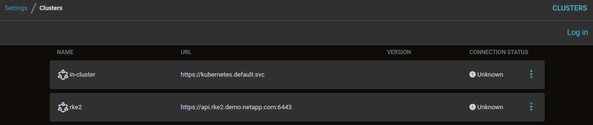

#########################################################################################
# Addenda 7: Install ArgoCD
#########################################################################################  

ArgoCD is a very popular tool for Kubernetes that enables Continuous Delivery of applications.  
We will deploy a minimal installation of ArgoCD via its Helm chart:  
```bash
rke1
helm repo add argo https://argoproj.github.io/argo-helm
helm install argocd argo/argo-cd --version 6.7.3 -n argocd --create-namespace -f argocd_values.yaml
```
After a few seconds, you should see the following:
```bash
$ kubectl get -n argocd pod
NAME                                                   READY   STATUS    RESTARTS   AGE
pod/argocd-application-controller-0                    1/1     Running   0          11h
pod/argocd-redis-5459c8bf77-rhd9r                      1/1     Running   0          11h
pod/argocd-repo-server-6575c9c546-j7gcm                1/1     Running   0          11h
pod/argocd-server-6b86db9cc9-lw69j                     1/1     Running   0          11h

$ kubectl get -n argocd svc argocd-server 
NAME            TYPE           CLUSTER-IP       EXTERNAL-IP     PORT(S)                      AGE
argocd-server   LoadBalancer   172.26.127.119   192.168.0.215   80:31128/TCP,443:30883/TCP   11h
```
In this example, the Load Balancer provided the address 192.168.0.215 to ArgoCD.  
You can use that address in the browser to reach this application.  
Note that you don't need to log in the GUI as authentication was disabled.  

We also need to install the ArgoCD binary, which be used to register the RKE2 cluster in the environment:
```bash
curl -sSL -o argocd-linux-amd64 https://github.com/argoproj/argo-cd/releases/latest/download/argocd-linux-amd64
install -m 555 argocd-linux-amd64 /usr/local/bin/argocd
rm -f argocd-linux-amd64
```
In order to register RKE2, you need to log in ArgoCD with the cli.  
You first need to retrieve the password, which is stored in a Kubernetes secret:  
```bash
$ kubectl -n argocd get secret argocd-initial-admin-secret -o jsonpath="{.data.password}" | base64 -d
LBUf82BNF4JSxuqP

$ argocd login 192.168.0.215 --username admin --password LBUf82BNF4JSxuqP --insecure 

$ rke2
$ argocd cluster add rke2 -y
INFO[0000] ServiceAccount "argocd-manager" already exists in namespace "kube-system" 
INFO[0000] ClusterRole "argocd-manager-role" updated    
INFO[0000] ClusterRoleBinding "argocd-manager-role-binding" updated 
Cluster 'https://api.rke2.demo.netapp.com:6443' added
```
Notice that registering the cluster in ArgoCD also means deploying a few objects in RKE2, such as service account,  clusterRole & clusterRoleBinding.  
If you went well, you can see the result in CLI:  
```bash
$ argocd cluster list
SERVER                                 NAME        VERSION  STATUS   MESSAGE                                                  PROJECT
https://api.rke2.demo.netapp.com:6443  rke2                 Unknown  Cluster has no applications and is not being monitored.  
https://kubernetes.default.svc         in-cluster           Unknown  Cluster has no applications and is not being monitored.  
```
You can also see that list in the GUI:  
<p align="center"></p>

There you go, ArgoCD is now ready to use!