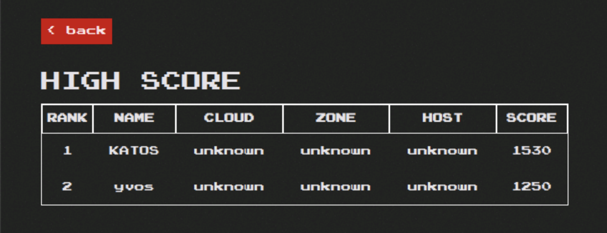

#########################################################################################
# SCENARIO 2.3: Seek & Destroy ! (and restore)
#########################################################################################

We currently are in a safe zone. Pacman is running. Snapshots & backups are planned, as well as mirroring.  
Similarly to most fairy tales, an evil person joins the party !

```bash
$ rke2
$ kubectl exec -it -n pacman $(kubectl get pod -n pacman -l "name=mongo" -o name) -- mongo --eval 'db.highscore.updateMany({},{$set:{name:"EVIL",cloud:"YOU",zone:"HAVE BEEN",host:"HACKED",score:"666"}});' pacman
MongoDB shell version: 3.2.21
connecting to: pacman
{ "acknowledged" : true, "matchedCount" : 2, "modifiedCount" : 0 }
```

<p align="center">:boom: :boom: :boom: :boom: :boom: :boom: :boom: :boom: :boom: :boom: :boom: :boom: :boom: :boom: :boom: :boom:</p>  
<p align="center"></p>
<p align="center">:boom: :boom: :boom: :boom: :boom: :boom: :boom: :boom: :boom: :boom: :boom: :boom: :boom: :boom: :boom: :boom:</p>  

As a great wise man would say: "oh oh !"  

No worries, you did all the necessary to protect your application.  
In my case, I can simply perform an _in place restore_ operation from the first manual backup we took.  

<p align="center"></p>

When clicking on _Next_, you will also need to confirm the restore operation, as you will replace the existing content with the backup.  
After a few minutes, there you go, the famous high scores are back !

<p align="center"></p>

& Once again, Astra Control saved the world from evil !