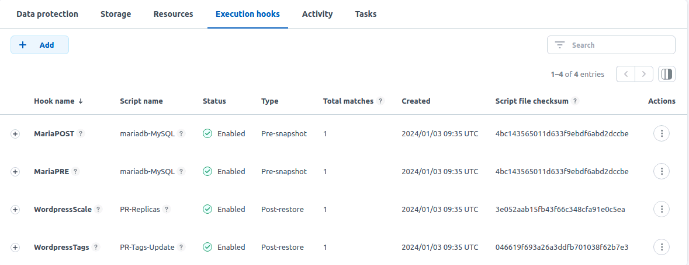

#########################################################################################
# Post Restore hook
#########################################################################################

This hook can be used to customize your app in a Restore scenario.  

When restoring an app, various choices are possible.  
You can restore on the same cluster, in a different one, perform a full restore or only a partial one.  
That said, the restored app may need to be customized!  

In some cases, the image repository may be different on the second site, the number of replicas required may be different, etc...  
That is when this post-restore hook can help you, in order to automatically apply the necesary changes.

As this lab comes with one image repository, in order to test the first hook easily, let's imagine an app (_wordpress_) that uses images with different tags (_site1_ & _site2_) depending on the site where it runs.  
Also, this app runs on site1 with _2 replicas_, but should run with only _1 replica_ on site2. Changing the number of replicas will be done by a second hook.   

Let's first push both images to the local repository (with 2 different tags) after retrieving it from a public repo:
```bash
podman pull docker.io/bitnami/wordpress:6.4.2-debian-11-r6
podman pull docker.io/bitnami/mariadb:11.2.2-debian-11-r0

podman login -u registryuser -p Netapp1! registry.demo.netapp.com

podman tag docker.io/bitnami/wordpress:6.4.2-debian-11-r6 registry.demo.netapp.com/bitnami/wordpress:site1
podman push registry.demo.netapp.com/bitnami/wordpress:site1
podman tag docker.io/bitnami/wordpress:6.4.2-debian-11-r6 registry.demo.netapp.com/bitnami/wordpress:site2
podman push registry.demo.netapp.com/bitnami/wordpress:site2

podman tag docker.io/bitnami/mariadb:11.2.2-debian-11-r0 registry.demo.netapp.com/bitnami/mariadb:site1
podman push registry.demo.netapp.com/bitnami/mariadb:site1
podman tag docker.io/bitnami/mariadb:11.2.2-debian-11-r0 registry.demo.netapp.com/bitnami/mariadb:site2
podman push registry.demo.netapp.com/bitnami/mariadb:site2
```
Alternatively, you can use the _scenario05_wordpress_images.sh_ to if needed. It uses 2 **optional** parameters, your Docker Hub login & password:
```bash
sh _scenario05-wordpress-images.sh my_login my_password
```

Now let's create the wordpress instance on the first site (ie on cluster _RKE1_):
```bash
rke1
helm install wphook bitnami/wordpress --namespace wphook --create-namespace -f helm-wordpress-values.yaml
```

Now, let's look at the images used by this new app:
```bash
$ kubectl get pods -n wphook -l app.kubernetes.io/instance=wphook -o=jsonpath='{range .items[*]}{"\n"}{.metadata.name}{":\t"}{.spec.containers[0].image}{end}'; echo

wphook-mariadb-0:	registry.demo.netapp.com/bitnami/mariadb:site1
wphook-wordpress-5b84766647-kfq69:	registry.demo.netapp.com/bitnami/wordpress:site1
wphook-wordpress-5b84766647-l25tf:	registry.demo.netapp.com/bitnami/wordpress:site1
```
We can see we are using images tagged with "site1".  

Both our hooks will run commands against the _kubectl_ command embedded in the alpine pod that runs in the same namespace.  
In order to avoid a security breach, this pod is associated to a service account that only allows operation within that namespace.  
```bash
$ kubectl create -f alpine-kubectl.yaml
serviceaccount/kubectl-ns-admin-sa created
rolebinding.rbac.authorization.k8s.io/kubectl-ns-admin-sa created
deployment.apps/astra-hook-deployment created
```

Next, the following steps need to be performed before the restore can be tested:  
- Enable scripts in ACC
- Manage the Wordpress app in ACC
- Configure the pre- & post- snapshot hooks
- Configure the two Post-Restore hooks
- Create a snapshot of your app (optional)
- Create a backup of your app based on the previous snapshot

This can also be achieved through the GUI, or _using the script in this folder which calls the ACC API_ (**WORK IN PROGRESS**).  

Once this is done, this is what you can expect to see in the GUI:
<p align="center"></p>

Let's try to restore this application on the second cluster (rke2) in a new namespace _wphookrestore_.  
This can be achieved via the GUI, or_using the script in the folder_ (**WORK IN PROGRESS**).  
```bash
$ rke2
$ kubectl get -n wphookrestore all,pvc
NAME                                         READY   STATUS    RESTARTS      AGE
pod/astra-hook-deployment-7b6cb87cff-wqn76   1/1     Running   0             43m
pod/wphook-mariadb-0                         1/1     Running   0             43m
pod/wphook-wordpress-5f486bf79d-xxrhd        1/1     Running   1 (42m ago)   43m

NAME                       TYPE           CLUSTER-IP     EXTERNAL-IP     PORT(S)                      AGE
service/wphook-mariadb     ClusterIP      172.28.32.16   <none>          3306/TCP                     43m
service/wphook-wordpress   LoadBalancer   172.28.72.61   192.168.0.232   80:30009/TCP,443:31750/TCP   43m

NAME                                    READY   UP-TO-DATE   AVAILABLE   AGE
deployment.apps/astra-hook-deployment   1/1     1            1           43m
deployment.apps/wphook-wordpress        1/1     1            1           43m

NAME                                               DESIRED   CURRENT   READY   AGE
replicaset.apps/astra-hook-deployment-7b6cb87cff   1         1         1       43m
replicaset.apps/wphook-wordpress-5b84766647        0         0         0       43m
replicaset.apps/wphook-wordpress-5f486bf79d        1         1         1       43m

NAME                              READY   AGE
statefulset.apps/wphook-mariadb   1/1     43m

NAME                                          STATUS   VOLUME                                     CAPACITY   ACCESS MODES   STORAGECLASS   AGE
persistentvolumeclaim/data-wphook-mariadb-0   Bound    pvc-3343c712-1852-435e-8b01-1683c86c8e8a   8Gi        RWX            sc-nas-svm2    45m
persistentvolumeclaim/wphook-wordpress        Bound    pvc-2096b9b2-5c74-4192-b7bc-40c3c615226e   10Gi       RWX            sc-nas-svm2    45m
```

The restore process worked !
And as you can see, the Wordpress deployment scaled down to **one replica** as expected.

Let's now check the images used by this new app:
```bash
$ kubectl get pods -n wphookrestore -l app.kubernetes.io/instance=wphook -o=jsonpath='{range .items[*]}{"\n"}{.metadata.name}{":\t"}{.spec.containers[0].image}{end}'; echo

wphook-mariadb-0:	registry.demo.netapp.com/bitnami/mariadb:site2
wphook-wordpress-5f486bf79d-xxrhd:	registry.demo.netapp.com/bitnami/wordpress:site2
```
As expected, we are now using a image different from the source application, this time tagged with **site2**.

Both _restore_ hooks also write logs in a file located in the alpine pod folder /var/log/.  
This can be useful to debug or follow up all the tasks performed during the restore proces.  
```bash
$ kubectl exec -n wphook2 $(kubectl get pod -n wphook2 -l app.kubernetes.io/name=scenario05 -o name) -- more /var/log/acc-logs-hooks.log
Wed Dec 20 13:48:43 UTC 2023: ========= HOOK REPLICAS SCALE START ===========
Wed Dec 20 13:48:43 UTC 2023: DEPLOYMENT TO SCALE: wordpress
Wed Dec 20 13:48:43 UTC 2023: NUMBER OF REPLICAS: 1
Wed Dec 20 13:48:43 UTC 2023: KUBERNETES DEPLOY NAME: wphook-wordpress
Wed Dec 20 13:48:43 UTC 2023: ========= HOOK REPLICAS SCALE END ===========
Wed Dec 20 13:48:44 UTC 2023: ========= HOOK TAG REWRITE START ===========
Wed Dec 20 13:48:44 UTC 2023: PARAMETER1: site1
Wed Dec 20 13:48:44 UTC 2023: PARAMETER2: site2
Wed Dec 20 13:48:44 UTC 2023: OBJECT TO SWAP: deploy wphook-wordpress : container 'wordpress'
Wed Dec 20 13:48:44 UTC 2023:    INITIAL IMAGE: registry.demo.netapp.com/bitnami/wordpress:site1
Wed Dec 20 13:48:44 UTC 2023:    TARGET TAG: site2
Wed Dec 20 13:48:44 UTC 2023:    NEW IMAGE: registry.demo.netapp.com/bitnami/wordpress:site2
Wed Dec 20 13:48:44 UTC 2023: OBJECT TO SWAP: sts wphook-mariadb: container 'mariadb'
Wed Dec 20 13:48:44 UTC 2023:    INITIAL IMAGE: registry.demo.netapp.com/bitnami/mariadb:site1
Wed Dec 20 13:48:44 UTC 2023:    TARGET TAG: site2
Wed Dec 20 13:48:44 UTC 2023:    NEW IMAGE: registry.demo.netapp.com/bitnami/mariadb:site2
Wed Dec 20 13:48:44 UTC 2023: ========= HOOK TAG REWRITE END ===========
```