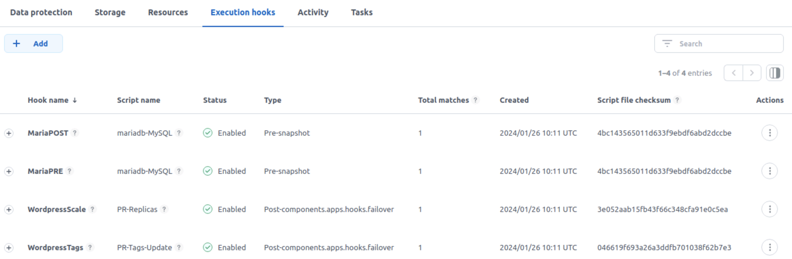
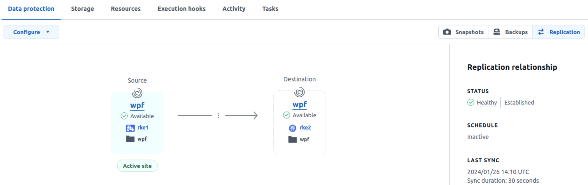
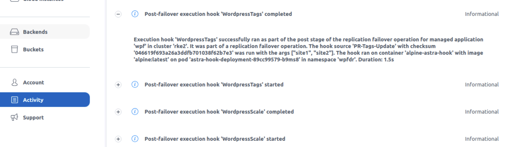

#########################################################################################
# Post Failover hook
#########################################################################################

This hook can be used to customize your app in a **Failover** scenario.  

When activating a DR, your target app may need to be customized!  

In some cases, the image repository may be different on the second site, the number of replicas required may be different, etc...  
That is when this post-failover hook can help you, in order to automatically apply the necessary changes.

As this lab comes with one image repository, in order to test the first hook easily, let's imagine an app (_wordpress_) that uses images with different tags (_site1_ & _site2_) depending on the site where it runs.  
Also, this app runs on site1 with _2 replicas_, but should run with only _1 replica_ on site2. Changing the number of replicas will be done by a second hook.   

<p align="center">:boom: :boom: :boom: :boom: :boom: :boom: :boom: :boom: :boom: :boom: :boom: :boom: :boom: :boom: :boom: :boom:</p>  

```diff
This scenario must be used with Astra Control 23.07. There is an issue in 23.10 that prevents the use of such hook.
```

<p align="center">:boom: :boom: :boom: :boom: :boom: :boom: :boom: :boom: :boom: :boom: :boom: :boom: :boom: :boom: :boom: :boom:</p>  


Let's first push both images to the local repository (with 2 different tags) after retrieving it from a public repo:
```bash
podman pull docker.io/bitnami/wordpress:6.4.2-debian-11-r6
podman pull docker.io/bitnami/mariadb:11.2.2-debian-11-r0

podman login -u registryuser -p Netapp1! registry.demo.netapp.com

podman tag docker.io/bitnami/wordpress:6.4.2-debian-11-r6 registry.demo.netapp.com/bitnami/wordpress:site1
podman push registry.demo.netapp.com/bitnami/wordpress:site1
podman tag docker.io/bitnami/wordpress:6.4.2-debian-11-r6 registry.demo.netapp.com/bitnami/wordpress:site2
podman push registry.demo.netapp.com/bitnami/wordpress:site2

podman tag docker.io/bitnami/mariadb:11.2.2-debian-11-r0 registry.demo.netapp.com/bitnami/mariadb:site1
podman push registry.demo.netapp.com/bitnami/mariadb:site1
podman tag docker.io/bitnami/mariadb:11.2.2-debian-11-r0 registry.demo.netapp.com/bitnami/mariadb:site2
podman push registry.demo.netapp.com/bitnami/mariadb:site2
```
Alternatively, you can use the _scenario05_wordpress_images.sh_ to if needed. It uses 2 **optional** parameters, your Docker Hub login & password:
```bash
sh _scenario05-wordpress-images.sh my_login my_password
```

Now let's create the wordpress instance on the first site (ie on cluster _RKE1_).  
This process takes a couple of minutes:  
```bash
rke1
helm install wpf bitnami/wordpress --namespace wpf --create-namespace -f helm-wordpress-values.yaml
```

Now, let's look at the images used by this new app:
```bash
$ kubectl get pods -n wpf -l app.kubernetes.io/instance=wpf -o=jsonpath='{range .items[*]}{"\n"}{.metadata.name}{":\t"}{.spec.containers[0].image}{end}'; echo

wpf-mariadb-0:	registry.demo.netapp.com/bitnami/mariadb:site1
wpf-wordpress-5b84766647-kfq69:	registry.demo.netapp.com/bitnami/wordpress:site1
wpf-wordpress-5b84766647-l25tf:	registry.demo.netapp.com/bitnami/wordpress:site1
```
We can see we are using images tagged with "site1".  

Both our hooks will run commands against the _kubectl_ command embedded in the alpine pod that runs in the same namespace.  
In order to avoid a security breach, this pod is associated to a service account that only allows operation within that namespace.  
```bash
$ kubectl create -f alpine-kubectl.yaml
serviceaccount/kubectl-ns-admin-sa created
rolebinding.rbac.authorization.k8s.io/kubectl-ns-admin-sa created
deployment.apps/astra-hook-deployment created
```

Next, the following steps need to be performed before the restore can be tested:  
- Enable scripts in ACC
- Manage the Wordpress app in ACC
- Configure the pre- & post- snapshot hooks
- Configure the two Post-Failover hooks
- Create a replication policy

This can also be achieved through the GUI, or using the script in this folder which calls the ACC API (_acc-api-app-config.sh_).  
This script takes 2 parameters: _Account ID_ & _API Token_. The [addenda01](../../../Addendum/Addenda01/) will guide you in the retrieval of both values.  
Finally, it will finish when the replication is ready to use (it takes a few minutes).  

Once this is done, this is what you can expect to see in the GUI:
<p align="center"></p>
<p align="center"></p>

Let's try to failover this application on the second cluster (rke2) in a new namespace _wpfdr_.  
This can be achieved via the GUI, or using the script _acc-api-app-failover.sh_ in this folder.  
Using the script follows the same path as the previous one, ie it takes the same 2 parameters & will end once the restored app process is complete.  

You can also follow the restore process in the _Activity_ window of Astra Control.
<p align="center"></p>

Once done, you can see a new application managed by Astra Control.
You can also check via the cli that the hooks were correctly executed.  
```bash
$ rke2
$ kubectl get -n wpf all,pvc
NAME                                           READY   STATUS    RESTARTS      AGE
pod/astra-hook-deployment-7b6cb87cff-wqn76   1/1     Running   0             43m
pod/wpf-mariadb-0                            1/1     Running   0             43m
pod/wpf-wordpress-5f486bf79d-xxrhd           1/1     Running   1 (42m ago)   43m

NAME                    TYPE           CLUSTER-IP     EXTERNAL-IP     PORT(S)                      AGE
service/wpf-mariadb     ClusterIP      172.28.32.16   <none>          3306/TCP                     43m
service/wpf-wordpress   LoadBalancer   172.28.72.61   192.168.0.232   80:30009/TCP,443:31750/TCP   43m

NAME                                    READY   UP-TO-DATE   AVAILABLE   AGE
deployment.apps/astra-hook-deployment   1/1     1            1           43m
deployment.apps/wpf-wordpress           1/1     1            1           43m

NAME                                               DESIRED   CURRENT   READY   AGE
replicaset.apps/astra-hook-deployment-7b6cb87cff   1         1         1       43m
replicaset.apps/wpf-wordpress-5b84766647           0         0         0       43m
replicaset.apps/wpf-wordpress-5f486bf79d           1         1         1       43m

NAME                              READY   AGE
statefulset.apps/wpf-mariadb      1/1     43m

NAME                                       STATUS   VOLUME                                     CAPACITY   ACCESS MODES   STORAGECLASS   AGE
persistentvolumeclaim/data-wpf-mariadb-0   Bound    pvc-3343c712-1852-435e-8b01-1683c86c8e8a   8Gi        RWX            sc-nas-svm2    45m
persistentvolumeclaim/wpf-wordpress        Bound    pvc-2096b9b2-5c74-4192-b7bc-40c3c615226e   10Gi       RWX            sc-nas-svm2    45m
```

The failover process worked !
And as you can see, the Wordpress deployment scaled down to **one replica** as expected.

Let's now check the images used by this new app:
```bash
$ kubectl get pods -n wpf -l app.kubernetes.io/instance=wpf -o=jsonpath='{range .items[*]}{"\n"}{.metadata.name}{":\t"}{.spec.containers[0].image}{end}'; echo

wpf-mariadb-0:	registry.demo.netapp.com/bitnami/mariadb:site2
wpf-wordpress-5f486bf79d-xxrhd:	registry.demo.netapp.com/bitnami/wordpress:site2
```
As expected, we are now using a image different from the source application, this time tagged with **site2**.

Both _restore_ hooks also write logs in a file located in the alpine pod folder /var/log/.  
This can be useful to debug or follow up all the tasks performed during the restore proces.  
```bash
$ kubectl exec -n wpfdr $(kubectl get pod -n wpfdr -l app.kubernetes.io/name=scenario05 -o name) -- more /var/log/acc-logs-hooks.log
Wed Dec 20 13:48:43 UTC 2023: ========= HOOK REPLICAS SCALE START ===========
Wed Dec 20 13:48:43 UTC 2023: APP TO SCALE: wordpress
Wed Dec 20 13:48:43 UTC 2023: NUMBER OF REPLICAS: 1
Wed Dec 20 13:48:43 UTC 2023: KUBERNETES DEPLOY NAME: wpf-wordpress
Wed Dec 20 13:48:43 UTC 2023: ========= HOOK REPLICAS SCALE END ===========
Wed Dec 20 13:48:44 UTC 2023: ========= HOOK TAG REWRITE START ===========
Wed Dec 20 13:48:44 UTC 2023: PARAMETER1: site1
Wed Dec 20 13:48:44 UTC 2023: PARAMETER2: site2
Wed Dec 20 13:48:44 UTC 2023: OBJECT TO SWAP: deploy wpf-wordpress : container 'wordpress'
Wed Dec 20 13:48:44 UTC 2023:    INITIAL IMAGE: registry.demo.netapp.com/bitnami/wordpress:site1
Wed Dec 20 13:48:44 UTC 2023:    TARGET TAG: site2
Wed Dec 20 13:48:44 UTC 2023:    NEW IMAGE: registry.demo.netapp.com/bitnami/wordpress:site2
Wed Dec 20 13:48:44 UTC 2023: OBJECT TO SWAP: sts wpf-mariadb: container 'mariadb'
Wed Dec 20 13:48:44 UTC 2023:    INITIAL IMAGE: registry.demo.netapp.com/bitnami/mariadb:site1
Wed Dec 20 13:48:44 UTC 2023:    TARGET TAG: site2
Wed Dec 20 13:48:44 UTC 2023:    NEW IMAGE: registry.demo.netapp.com/bitnami/mariadb:site2
Wed Dec 20 13:48:44 UTC 2023: ========= HOOK TAG REWRITE END ===========
```

Optionnally, you can clean up your ACC environments and remove objects used in this scenario.  
The script _acc-api-scenario-cleanup.sh_ will perform the following tasks:
- delete the replication policy
- unmanage the two _wpf_ applications 
- delete the two _wpf_ helm deployment
- delete the two _wpf_ namespace
