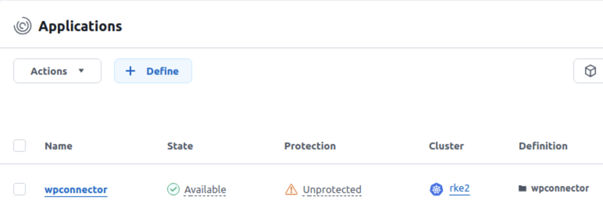
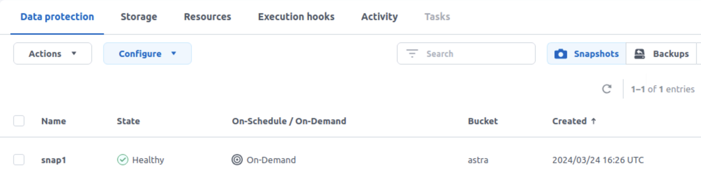
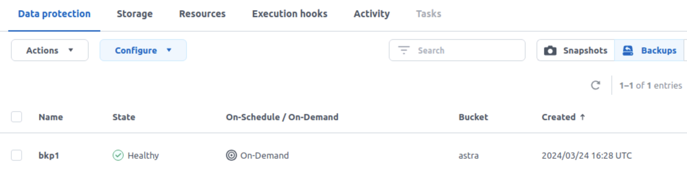
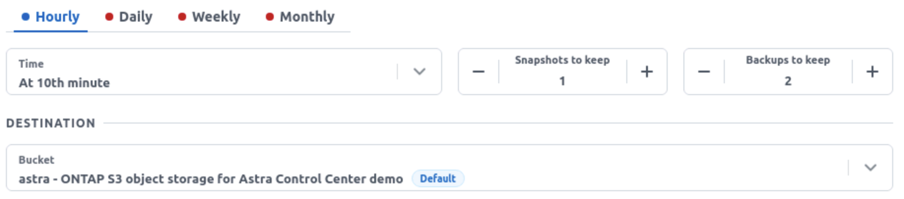

#########################################################################################
# SCENARIO 6: Protect you app with the Astra connector manually (Tech Preview)
#########################################################################################  

Astra 24.02 released the Astra Connector which allows you to manage your applications declaratively.  
If you have not yet upgraded to 24.02, nor installed the connector, please follow the [Addenda02](../../Addendum/Addenda02/) which will guide you through these tasks.  

Let's start by installing a new app on the cluster RKE2, the following commands running on the host _helper1_:
```bash
$ rke2
$ helm install wpconnector bitnami/wordpress --namespace wpconnector --set wordpressUsername=astra,wordpressPassword=Netapp1! --create-namespace
NAME: wpconnector
LAST DEPLOYED: Sun Mar 24 16:17:45 2024
NAMESPACE: wpconnector
STATUS: deployed
...
```

After a minute or so, the application shoudl be up&running:
```bash
$ kubectl get -n wpconnector pod,pvc
NAME                                         READY   STATUS    RESTARTS   AGE
pod/wpconnector-mariadb-0                    1/1     Running   0          2m43s
pod/wpconnector-wordpress-5f8dbb6798-whdpn   1/1     Running   0          2m43s

NAME                                               STATUS   VOLUME                                     CAPACITY   ACCESS MODES   STORAGECLASS   AGE
persistentvolumeclaim/data-wpconnector-mariadb-0   Bound    pvc-45e5cd64-4aeb-474b-8b71-1a0c994aa023   8Gi        RWO            sc-nas-svm2    2m43s
persistentvolumeclaim/wpconnector-wordpress        Bound    pvc-19da82cd-e421-4177-ab3a-71ca4a2afe74   10Gi       RWO            sc-nas-svm2    2m43s
```

We are now ready to proceed with the declarative configuration:  
Let's start by managing Wordpress:
```bash
$ cat << EOF | kubectl apply -f -
apiVersion: astra.netapp.io/v1
kind: Application
metadata:
  name: wpconnector
  namespace: astra-connector
spec:
  includedNamespaces:
    - namespace: wpconnector
EOF
application.astra.netapp.io/wpconnector created

$ kubectl get -n astra-connector applications
NAME          AGE
wpconnector   14s
```

When connecting to the ACC GUI, you will notice that your application is now managed:
<p align="center"></p>

If you have not yet declared a bucket to host the backups, Astra Connector will retrieve its configuration from Astra Control:  
```bash
$ kubectl get -n astra-connector appvaults
NAME                                                  AGE
ontap-s3-astra-ec85f45c-04db-4a92-b2d7-80d401affcdb   3m9s
```
This ID is unique to each installation, your will look different.  

Time to create your first snapshot (replace the _appVaultRef_ field with your own):  
```bash
$ cat << EOF | kubectl apply -f -
apiVersion: astra.netapp.io/v1
kind: Snapshot
metadata:
  name: snap1
  namespace: astra-connector
spec:
  applicationRef: wpconnector
  appVaultRef: ontap-s3-astra-ec85f45c-04db-4a92-b2d7-80d401affcdb
EOF
snapshot.astra.netapp.io/snap1 created

$ kubectl get -n astra-connector snapshots
NAME    STATE       ERROR   AGE
snap1   Completed           14s
```
You can also see the snapshot result in the GUI:
<p align="center"></p>

You can also try a backup (replace the _appVaultRef_ field with your own):
```bash
$ cat << EOF | kubectl apply -f -
apiVersion: astra.netapp.io/v1
kind: Backup
metadata:
  name: bkp1
  namespace: astra-connector
spec:
  applicationRef: wpconnector
  appVaultRef: ontap-s3-astra-ec85f45c-04db-4a92-b2d7-80d401affcdb
EOF
backup.astra.netapp.io/bkp1 created

$ kubectl get -n astra-connector backups
NAME   STATE     ERROR   AGE
bkp1   Running           18s
```
Again, you can also see the backup in the GUI:
<p align="center"></p>

And finally, you can create a protection policy (replace the _appVaultRef_ field with your own):  
```bash
$ cat << EOF | kubectl apply -f -
apiVersion: astra.netapp.io/v1
kind: Schedule
metadata:
  name: sched
  namespace: astra-connector
spec:
  applicationRef: wpconnector
  appVaultRef: ontap-s3-astra-ec85f45c-04db-4a92-b2d7-80d401affcdb
  backupRetention: "2"
  snapshotRetention: "1"
  granularity: hourly
  minute: "10"
EOF
schedule.astra.netapp.io/sched created

$ kubectl get -n astra-connector schedules
NAME    AGE
sched   15s
```
The schedule can be seen in the GUI:
<p align="center"></p>

Let's try to restore our backup to a new namespace on the same cluster.  
To do so, we first need to find the path of our backup on the object store:  
```bash
$ kubectl -n astra-connector get backups bkp1 -o=jsonpath='{.status.appArchivePath}'
wpconnector_c4e2d255-1be1-4498-af22-0fc1c7ef21c3/backups/bkp1_4c8d4eec-ead1-4661-96a6-e3adcdb28428
```
Let's create a CR to perform the restore (replace the _appVaultRef_ & _appArchivePath_ fields with your own):  
```bash
cat << EOF | kubectl apply -f -
apiVersion: astra.netapp.io/v1
kind: BackupRestore
metadata:
  name: bkprestore-to-wpconnectorresto
  namespace: astra-connector
spec:
  appVaultRef: ontap-s3-astra-ec85f45c-04db-4a92-b2d7-80d401affcdb
  appArchivePath: wpconnector_c4e2d255-1be1-4498-af22-0fc1c7ef21c3/backups/bkp1_4c8d4eec-ead1-4661-96a6-e3adcdb28428
  namespaceMapping: [{"source": "wpconnector", "destination": "wpconnectorresto"}]
EOF
```
After a couple of minutes, you should see the following:
```bash
$ kubectl get -n astra-connector backuprestore
NAME                       STATE       ERROR   AGE
bkprestore-to-wpbkpresto   Completed           2m

$ helm ls -n wpconnectorresto
NAME       	NAMESPACE       	REVISION	UPDATED                      	STATUS  	CHART           	APP VERSION
wpconnector	wpconnectorresto	1       	2024-03-25 15:06:01 +0000 UTC	deployed	wordpress-18.0.8	6.3.2      

$ kubectl get -n wpconnectorresto pod,pvc
NAME                                         READY   STATUS    RESTARTS   AGE
pod/wpconnector-mariadb-0                    1/1     Running   0          114s
pod/wpconnector-wordpress-5f8dbb6798-5gsfq   1/1     Running   0          114s

NAME                                               STATUS   VOLUME                                     CAPACITY   ACCESS MODES   STORAGECLASS   AGE
persistentvolumeclaim/data-wpconnector-mariadb-0   Bound    pvc-ca8cac1d-c10c-40e0-81ee-5ff30c702504   8Gi        RWO            sc-nas-svm2    2m
persistentvolumeclaim/wpconnector-wordpress        Bound    pvc-7b76b8f1-e438-4140-9844-7af027da1992   10Gi       RWO            sc-nas-svm2    2m
```

Notes:  
- with 24.02, you can currently restore from a snapshot & a backup, in-place or in a new namespace, but only on the same cluster  
- restoring an application does not create a CR for the target app  
