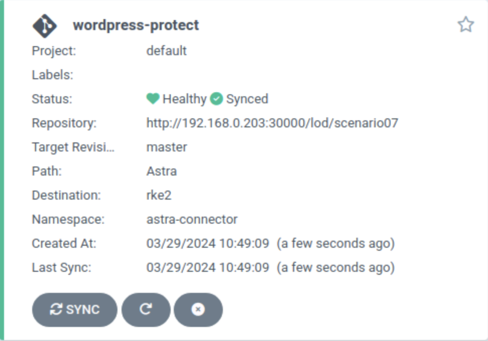
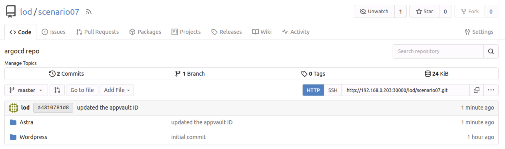
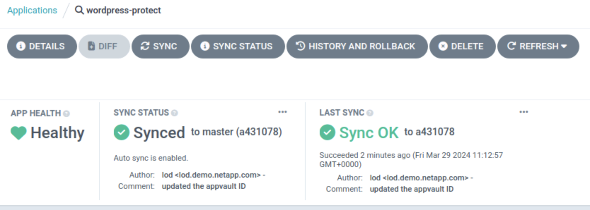

#########################################################################################
# SCENARIO 7: Protect you app with the Astra connector & ArgoCD (Tech Preview)
#########################################################################################  

Astra 24.02 released the Astra Connector which allows you to manage your applications declaratively.  
The [scenario06](../Scenario06/) already guides you through this new model, by manually creating Snapshots CR, Schedule CR, etc...  

This scenario goes a step further by integrating the protection management with a tool such as ArgoCD.  
It will guide you through the following:
- Creation of a Git repository  
- Host scenario files in this Git repository  
- Integration & Deployment of a small app (wordpress) with ArgoCD  
- Automate the scheduling of snapshots & backups by Astra Connector with ArgoCD

<p align="center"></p>

The prerequisites of this lab are the following:
- Upgrade the lab to [24.02](../../Addendum/Addenda02/)  
- Install the [Astra Connector](../../Addendum/Addenda02/5_Install_Connector_on_RKE2/)  
- Install the lightweight Git repository [Gitea](../../Addendum/Addenda07/1_Gitea/)  
- Install the continuous deployment tool [ArgoCD](../../Addendum/Addenda07/2_ArgoCD/)  

Let's first create a new repository in Gitea:
```bash
curl -X POST "http://192.168.0.203:30000/api/v1/user/repos" -u lod:Netapp1! -H "accept: application/json" -H "content-type: application/json" -d '{
  "name":"scenario07",
  "description": "argocd repo"
}'
```
You will find here a folder called _Repository_ that will be used as a base. Feel free to add your own apps in there for the sake of fun!  
The following will push the data to the newly created repository. Once pushed, you can connect to the Gitea UI & see the result.  
Also, the _schedule.yaml_ file is configured to create hourly snapshots at 10 minutes from the hour.  
You may want to change that to witness automatic snapshot creation faster.  
```bash
cp -R ~/LabAstraControl/LoD_ACC_v1.4/Scenarios-ACC/Scenario07/Repository ~/
cd ~/Repository
git init
git add .
git commit -m "initial commit"
git remote add origin http://192.168.0.203:30000/lod/scenario07.git
git push -u origin master
```
<p align="center"></p>

Let's deploy a new application. Instead of creating it with Helm, we are going to use ArgoCD.  
This could be done with the GUI or via the ArgoCD CRD, method used in the following example:  
```bash
$ rke1
$ kubectl create -f ~/LabAstraControl/LoD_ACC_v1.4/Scenarios-ACC/Scenario07/argocd_wordpress_deploy.yaml
application.argoproj.io/wordpress created
```
In a nutshell, we defined in that file the following:
- the repo where the YAML manifests are stored (http://192.168.0.203:30000/lod/scenario07)
- the directory to use in that repo (Wordpress)
- the Kubernetes cluster where the app will be deployed (RKE2)  
- the target namespace (wpargo)  

If all went well, you would see the app in the ArgoCD GUI:
<p align="center"></p>

As the CR was defined with an automated sync policy, the application will automatically appear on RKE2:
```bash
$ rke2
$ kubectl get -n wpargo pod,svc,pvc
NAME                                   READY   STATUS    RESTARTS   AGE
pod/wordpress-7c945b79c8-zv7sl         1/1     Running   0          3m52s
pod/wordpress-mysql-7c4d5fc78c-4xpjh   1/1     Running   0          3m52s

NAME                      TYPE           CLUSTER-IP       EXTERNAL-IP     PORT(S)        AGE
service/wordpress         LoadBalancer   172.28.187.240   192.168.0.234   80:32467/TCP   3m52s
service/wordpress-mysql   ClusterIP      None             <none>          3306/TCP       3m52s

NAME                              STATUS   VOLUME                                     CAPACITY   ACCESS MODES   STORAGECLASS   AGE
persistentvolumeclaim/mysql-pvc   Bound    pvc-9dc10e4f-54a8-45fe-a7db-4765b53b6165   20Gi       RWX            sc-nas-svm2    3m52s
persistentvolumeclaim/wp-pvc      Bound    pvc-86ec7250-3566-48db-be92-107dd7e5eb88   20Gi       RWX            sc-nas-svm2    3m52s
```

Time to protect this application!  
The repo also has 2 files to create the following Astra CR:
- _Application_ to define Wordpress  
- _Schedule_ to automatically take snapshots & backups  

We defined in that file the following:
- the repo where the YAML manifests are stored (http://192.168.0.203:30000/lod/scenario07)
- the directory to use in that repo (Astra)
- the Kubernetes cluster where the app will be deployed (RKE2) 
- the target namespace (astra-connector)  
```bash
$ rke1
$ kubectl create -f ~/LabAstraControl/LoD_ACC_v1.4/Scenarios-ACC/Scenario07/argocd_wordpress_protect.yaml
application.argoproj.io/wordpress-protect created
```
If all went well, you would see the app in the ArgoCD GUI:
<p align="center"></p>

Also, using the CLI you will find a new Astra CR for Wordpress:
```bash
$ rke2
$ kubectl get application -n astra-connector
NAME     AGE
wpargo   2m36s
```
As the Astra Connector is linked to Astra Control Center, you can also check that Wordpress appeared in the GUI:
<p align="center"></p>

In the current version, the Astra Connector will automatically create a CR for the object store (AppVault) once the first application CR is present. The _schedule.yaml_ file uploaded in the Gitea repo does not have the current value !!  
Time to change that value, upload the file to the repo & let ArgoCD do its magic:  
```bash
rke2
APPVAULT=$(kubectl get appvault -n astra-connector -o name | awk -F '/' '{print $2}')
sed -i "s/ontap-s3-astra-ec85f45c-04db-4a92-b2d7-80d401affcdb/$APPVAULT/" ~/Repository/Astra/schedule.yaml
git adcom "updated the appvault ID"
git push
```
Check that the repo is up to date
<p align="center"></p>
& that ArgoCD has performed a new sync
<p align="center"></p>

From, depending on the schedule configured, you will see snapshots & backups showing up:  
```bash
$ rke2
$ kubectl get -n astra-connector snapshot,backup
NAME                                                   STATE     ERROR   AGE
snapshot.astra.netapp.io/hourly-7e1ef-20240329111000   Running           56m

NAME                                                 STATE     ERROR   AGE
backup.astra.netapp.io/hourly-7e1ef-20240329111000   Running           56m
```