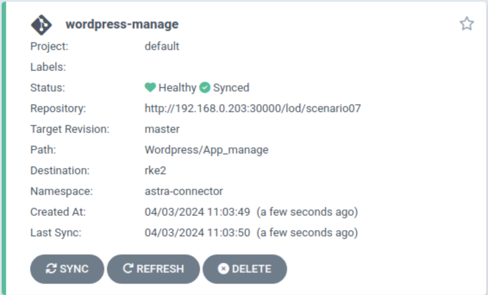

#########################################################################################
# SCENARIO 7: Protect you app with the Astra connector & ArgoCD (Tech Preview)
#########################################################################################  

Astra 24.02 released the Astra Connector which allows you to manage your applications declaratively.  
The [scenario06](../Scenario06/) already guides you through this new model, by manually creating Snapshots CR, Schedule CR, etc...  

This scenario goes a step further by integrating the protection management with a tool such as ArgoCD.  
It will guide you through the following:
- Creation of a Git repository  
- Host scenario files in this Git repository  
- Integration & Deployment of a small app (wordpress) with ArgoCD  
- Automate the scheduling of snapshots & backups by Astra Connector with ArgoCD

<p align="center"></p>

The prerequisites of this lab are the following:
- Upgrade the lab to [24.02](../../Addendum/Addenda02/)  
- Install the [Astra Connector](../../Addendum/Addenda02/5_Install_Connector_on_RKE2/)  
- Install the lightweight Git repository [Gitea](../../Addendum/Addenda07/1_Gitea/)  
- Install the continuous deployment tool [ArgoCD](../../Addendum/Addenda07/2_ArgoCD/)  

Let's first create a new repository in Gitea:
```bash
curl -X POST "http://192.168.0.203:30000/api/v1/user/repos" -u lod:Netapp1! -H "accept: application/json" -H "content-type: application/json" -d '{
  "name":"scenario07",
  "description": "argocd repo"
}'
```
You will find here a folder called _Repository_ that will be used as a base. Feel free to add your own apps in there for the sake of fun!  
The following will push the data to the newly created repository. Once pushed, you can connect to the Gitea UI & see the result.  
Also, the _schedule.yaml_ file is configured to create hourly snapshots at 10 minutes from the hour.  
You may want to change that to witness automatic snapshot creation faster.  
```bash
cp -R ~/LabAstraControl/LoD_ACC_v1.4/Scenarios-ACC/Scenario07/Repository ~/
cd ~/Repository
git init
git add .
git commit -m "initial commit"
git remote add origin http://192.168.0.203:30000/lod/scenario07.git
git push -u origin master
```
<p align="center"></p>

Before moving to the application management, we first need to define an AppVault (ie _a S3 Bucket_) in the Astra Connector.  
- you can create your own CR to connect to a bucket  
- you can also wait for the first app to be created, at which moment, the connector will retrieve the default Bucket from Astra Control Center  

We are going to use the first method and create our own with the help of ArgoCD.  
Note that I stored the bucket secret in Gitea, which is not really what you would do in production...  
```bash
$ rke1
$ kubectl create -f ~/LabAstraControl/LoD_ACC_v1.4/Scenarios-ACC/Scenario07/argocd_astra_appvault.yaml
application.argoproj.io/astra-appvault created
```
If all went well, you would see the app in the ArgoCD GUI:
<p align="center"></p>

You can also see the result in the Astra Connector:
```bash
$ rke2
$ kubectl get -n astra-connector appvault
NAME                                                  AGE
rke2-appvault                                         2m39s
```

Let's deploy a new application. Instead of creating it with Helm, we are going to use ArgoCD.  
This could be done with the GUI or via the ArgoCD CRD, method used in the following example:  
```bash
$ rke1
$ kubectl create -f ~/LabAstraControl/LoD_ACC_v1.4/Scenarios-ACC/Scenario07/argocd_wordpress_deploy.yaml
application.argoproj.io/wordpress created
```
In a nutshell, we defined in the _argocd_wordpress_deploy.yaml_ file the following:
- the repo where the YAML manifests are stored ("ht<span>tp://</span>192.168.0.203:30000/lod/scenario07")
- the directory to use in that repo (Wordpress/App_config)
- the Kubernetes cluster where the app will be deployed (RKE2)  
- the target namespace (wpargo)  

If all went well, you would see the app in the ArgoCD GUI:
<p align="center"></p>

As the CR was defined with an automated sync policy, the application will automatically appear on RKE2:
```bash
$ rke2
$ kubectl get -n wpargo pod,svc,pvc
NAME                                   READY   STATUS    RESTARTS   AGE
pod/wordpress-7c945b79c8-zv7sl         1/1     Running   0          3m52s
pod/wordpress-mysql-7c4d5fc78c-4xpjh   1/1     Running   0          3m52s

NAME                      TYPE           CLUSTER-IP       EXTERNAL-IP     PORT(S)        AGE
service/wordpress         LoadBalancer   172.28.187.240   192.168.0.234   80:32467/TCP   3m52s
service/wordpress-mysql   ClusterIP      None             <none>          3306/TCP       3m52s

NAME                              STATUS   VOLUME                                     CAPACITY   ACCESS MODES   STORAGECLASS   AGE
persistentvolumeclaim/mysql-pvc   Bound    pvc-9dc10e4f-54a8-45fe-a7db-4765b53b6165   20Gi       RWX            sc-nas-svm2    3m52s
persistentvolumeclaim/wp-pvc      Bound    pvc-86ec7250-3566-48db-be92-107dd7e5eb88   20Gi       RWX            sc-nas-svm2    3m52s
```

Connect to the address assigned by the Load Balancer (_192.168.0.234_ in this example) to check that it works.  
You can even start your blog if you want.  

Time to protect this application!  
The repo also has 2 files in the _App_manage_ folder to create the following Astra CR:
- _application.yaml_ to define Wordpress as an application to manage with Astra  
- _schedule.yaml_ to automatically take snapshots & backups  

We defined in the _argocd_wordpress_manage.yaml_ file the following:
- the repo where the YAML manifests are stored ("ht<span>tp://</span>192.168.0.203:30000/lod/scenario07")
- the directory to use in that repo (Wordpress/App_manage)
- the Kubernetes cluster where the app will be deployed (RKE2) 
- the target namespace (astra-connector)  

```bash
$ rke1
$ kubectl create -f ~/LabAstraControl/LoD_ACC_v1.4/Scenarios-ACC/Scenario07/argocd_wordpress_manage.yaml
application.argoproj.io/wordpress-manage created
```
If all went well, you would see the app in the ArgoCD GUI:
<p align="center"></p>

Also, using the CLI you will find two new Astra CR for Wordpress:
```bash
$ rke2
$ kubectl get application,schedule -n astra-connector
NAME                                 AGE
application.astra.netapp.io/wpargo   4m49s

NAME                             AGE
schedule.astra.netapp.io/sched   4m49s
```
As the Astra Connector is linked to Astra Control Center, you can also check that Wordpress appeared in the GUI:
<p align="center"></p>

From there, depending on the schedule configured, you will see snapshots & backups showing up:  
```bash
$ rke2
$ kubectl get -n astra-connector snapshot,backup
NAME                                                   STATE     ERROR   AGE
snapshot.astra.netapp.io/hourly-7e1ef-20240329111000   Running           56m

NAME                                                 STATE     ERROR   AGE
backup.astra.netapp.io/hourly-7e1ef-20240329111000   Running           56m
```

Now what?  
SEEK & DESTROY !!  

Let's delete the wordpress database, just for fun ...  
```bash
rke2
kubectl exec -n wpargo $(kubectl get pod -n wpargo -l tier=mysql -o name) -- sh -c 'export MYSQL_PWD=Netapp1!; mysql -e "DROP DATABASE wordpress;"'
```

WHOOPSY ... I think I did it again...  

If you try to connect to the Wordpress UI, you will then see:
<p align="center"></p>

Let's try to restore lost data from one of our backups, in order to go back to a nominal state.  
Astra Control allows to you to restore:
- in-place (to the source namespace)  
- to a different destination (same cluster or different cluster)  
- all the objects (full restore)  
- a subset of objects (partial restore)  

We will perform a partial in-place restore in this scenario.  
To do so, we first need to retrieve the _path_ of our backup (let's take the oldest backup):
```bash
$ kubectl get -n astra-connector backup
NAME                          STATE       ERROR   AGE
hourly-20595-20240405065000   Completed           75m
hourly-20595-20240405075000   Completed           15m

$ ARCHIVEPATH=$(kubectl get -n astra-connector backup hourly-20595-20240405065000 -o=jsonpath='{.status.appArchivePath}')

$ cat << EOF | kubectl create -f -
apiVersion: astra.netapp.io/v1
kind: BackupInplaceRestore
metadata:
  generateName: backupipr-
  namespace: astra-connector
spec:
  appArchivePath: $ARCHIVEPATH
  appVaultRef: rke2-appvault
  resourceFilter:
    resourceSelectionCriteria: include
    resourceMatchers:
    - kind: PersistentVolumeClaim
      names:
      - mysql-pvc
      version: v1
EOF
backupinplacerestore.astra.netapp.io/backupipr-8jlwv created
```
After a couple of minutes, you should see the following:
```bash
$ kubectl get -n astra-connector backupinplacerestore
NAME                                             STATE       ERROR   AGE
backupipr-8jlwv                                  Completed           68s

$ kubectl get -n wpargo pod,pvc
NAME                                   READY   STATUS    RESTARTS   AGE
pod/wordpress-7c945b79c8-cnwdq         1/1     Running   0          14h
pod/wordpress-mysql-7c4d5fc78c-zkp2g   1/1     Running   0          41s

NAME                              STATUS   VOLUME                                     CAPACITY   ACCESS MODES   STORAGECLASS   AGE
persistentvolumeclaim/mysql-pvc   Bound    pvc-9c070900-54d8-402f-90ac-3bf167f520eb   20Gi       RWX            sc-nas-svm2    43s
persistentvolumeclaim/wp-pvc      Bound    pvc-157f1ca8-d6aa-47ba-9859-71af401abeb1   20Gi       RWX            sc-nas-svm2    14h
```

You can now go back to the Wordpress UI & refresh the page. You will see that your content is back to life!  

By the way, you could also interact with the Astra Connector with the Toolkit.  
For instance, the command corresponding to the IPR task earlier is:  
```bash
actoolkit --v3 ipr --backup hourly-20595-20240405065000 wpargo --filterSelection include --filterSet version=v1,kind=PersistentVolumeClaim,name=mysql-pvc
```
